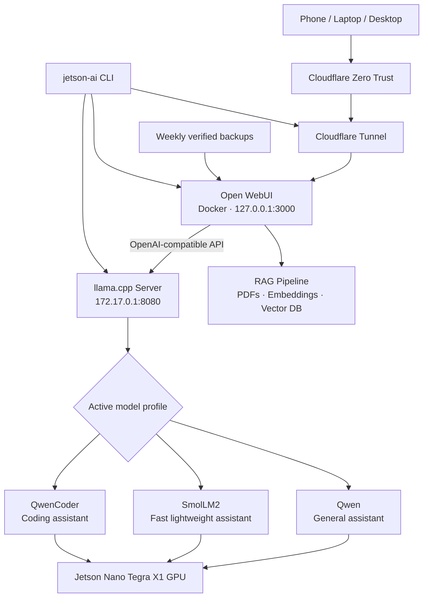

<div align="center">

# Jetson Nano AI Server

### A reproducible, CUDA-accelerated, self-hosted AI platform for the original 4 GB NVIDIA Jetson Nano

Run local LLMs with `llama.cpp`, switch between general, fast, and coding models, chat through Open WebUI, query your own documents with RAG, and access the system securely from anywhere through Cloudflare Zero Trust.

[](https://github.com/nihalgupta84/jetson-nano-guide/releases/tag/v1.0.0)
[](#verified-platform)
[](#verified-platform)
[](#verified-platform)
[](#verified-platform)
[](#system-architecture)

[Quick start](#quick-start) · [Documentation](#documentation) · [Benchmarks](#verified-benchmarks) · [Management](#one-command-management) · [Release notes](RELEASE_NOTES_v1.0.0.md)

</div>

---

## Why this project exists

The original Jetson Nano remains a capable low-power edge computer, but its JetPack 4.x software stack, CUDA 10.2 toolchain, Maxwell GPU, ARM64 architecture, and 4 GB shared memory make modern local-LLM deployment unusually difficult.

This repository documents a complete working solution rather than a collection of unverified commands. It covers the compatibility patches, pinned toolchain, CUDA build, model benchmarks, browser UI, secure remote access, document retrieval, model switching, backups, health checks, and day-to-day administration used on a real Jetson Nano.

## What is included

| Capability | Status | Implementation |
|---|---:|---|
| CUDA-accelerated local inference | Verified | Pinned `llama.cpp` build for CUDA 10.2 and compute capability 5.3 |
| OpenAI-compatible API | Verified | `llama-server` on the Docker bridge |
| Browser chat interface | Verified | Open WebUI in ARM64 Docker |
| Secure access from any network | Verified | Cloudflare Tunnel and Zero Trust Access |
| Retrieval-Augmented Generation | Verified | PDF ingestion, embeddings, vector search, grounded answers |
| Multi-model profiles | Verified | Qwen, SmolLM2, and QwenCoder |
| Friendly model names | Verified | `Qwen`, `SmolLM2`, and `QwenCoder` API aliases |
| Automatic startup | Verified | `systemd`, Docker restart policy, `/data` mount dependency |
| Health monitoring | Verified | Local API, WebUI, public endpoint, services, memory, and storage |
| Automated backups | Verified | Weekly, archive-validated Open WebUI volume backups |
| Unified administration | Verified | Single `jetson-ai` management command |

## System architecture



Only one generation model is loaded at a time. This keeps the system practical on the Nano's 4 GB shared memory while still providing task-specific profiles.

## Verified platform

| Component | Verified value |
|---|---|
| Hardware | NVIDIA Jetson Nano Developer Kit, 4 GB |
| CPU architecture | `aarch64` / ARM64 |
| GPU | NVIDIA Tegra X1, Maxwell |
| Compute capability | 5.3 |
| Operating system | Ubuntu 18.04.6 LTS |
| L4T | 32.6.1 |
| JetPack generation | 4.6 |
| CUDA toolkit | 10.2.300 |
| GCC/G++ | 8.5.0 under `/data/gcc-8.5` |
| CMake | 3.22.6 |
| `llama.cpp` | tag `b5050`, commit `23106f94e` |
| Docker | ARM64 deployment with data root on `/data` |
| LLM context | 768 tokens in the stable configuration |

> [!IMPORTANT]
> This guide targets the **original Jetson Nano and JetPack 4.x**. Do not blindly substitute JetPack 5/6, a newer CUDA toolkit, an arbitrary recent `llama.cpp` checkout, or the default GCC. Those combinations may not support the Nano or CUDA 10.2.

## Supported model profiles

| Command | Display name | Purpose | GGUF size | Verified behavior |
|---|---|---|---:|---|
| `qwen` | Qwen | General chat and document answers | 469 MB | Better overall response quality |
| `smol` | SmolLM2 | Fast, lightweight chat | 259 MB | Highest tested generation speed |
| `coder` | QwenCoder | Focused coding help | 469 MB | Full 25/25-layer CUDA offload |

Switching is atomic, health-checked, and automatically rolls back if the new profile does not become ready.

```bash
sudo switch-jetson-model qwen
sudo switch-jetson-model smol
sudo switch-jetson-model coder
sudo switch-jetson-model status
```

## Verified benchmarks

All results below were measured on the same Jetson Nano using four CPU threads, a 128-token prompt-processing test, and a 64-token generation test.

| Model | Backend | Prompt processing | Token generation |
|---|---|---:|---:|
| SmolLM2-360M Q4_K_M | CUDA, `-ngl 99` | 154.11 tok/s | 14.13 tok/s |
| SmolLM2-360M Q4_K_M | CPU, `-ngl 0` | 135.21 tok/s | 7.08 tok/s |
| Qwen2.5-0.5B Q4_K_M | CUDA, `-ngl 99` | 168.54 tok/s | 11.35 tok/s |
| Qwen2.5-0.5B Q4_K_M | CPU, `-ngl 0` | 126.45 tok/s | 5.83 tok/s |

Detailed reports:

- [Qwen2.5-0.5B benchmark](benchmarks/2026-08-02-qwen2.5-0.5b-q4km.md)
- [SmolLM2-360M benchmark](benchmarks/2026-08-02-smollm2-360m-q4km.md)

## Quick start

This is not a generic one-command installer. The build is intentionally pinned and documented so it can be reproduced safely on the legacy JetPack stack.

### 1. Prepare the device

Start with the hardware and software baseline:

- [Verified baseline](docs/01-baseline.md)
- [Recovery from a blank or removed device](docs/02-recovery-from-blank-device.md)

Run the installation and build scripts in numerical order from [`scripts/`](scripts/). Model binaries, compiler source trees, build directories, and other large generated artifacts are intentionally not committed.

### 2. Verify CUDA inference

```bash
cd /data/llama.cpp
./build-nano/bin/llama-cli --version
ldd ./build-nano/bin/llama-cli | grep -Ei 'cuda|cublas'
```

A correct build detects the Tegra X1 and links against CUDA 10.2, cuBLAS, and the Jetson CUDA driver.

### 3. Start the managed AI stack

```bash
sudo systemctl enable --now llama-server
sudo systemctl enable --now cloudflared
sudo systemctl enable --now docker
sudo jetson-ai health
```

Expected final line:

```text
Jetson AI stack is healthy.
```

### 4. Open the interface

Open WebUI is available locally through the configured port and remotely through the protected Cloudflare hostname. The example production deployment uses:

```text
https://ai.nihalgupta.me
```

Use your own domain and Cloudflare Access policy when reproducing the setup.

## One-command management

The `jetson-ai` utility provides a single entry point for normal administration.

```bash
sudo jetson-ai status
sudo jetson-ai health
sudo jetson-ai model qwen
sudo jetson-ai model smol
sudo jetson-ai model coder
sudo jetson-ai storage
sudo jetson-ai backup
sudo jetson-ai logs llama
sudo jetson-ai logs webui
sudo jetson-ai logs cloudflare
sudo jetson-ai logs backup
sudo jetson-ai restart
```

### Example status dashboard

```text
========== SERVICES ==========
llama-server       active
cloudflared        active
docker             active
open-webui         state=running health=healthy restart=unless-stopped

========== ACTIVE MODEL ==========
Configured model : qwen
Display alias    : Qwen
API model        : Qwen

========== ENDPOINTS ==========
[OK]   llama-server
[OK]   Open WebUI
[OK]   Public endpoint
```

See [Unified Jetson AI management command](docs/18-unified-jetson-ai-management-command.md).

## Open WebUI and RAG

Open WebUI provides the browser interface, user accounts, chat history, document ingestion, embeddings, vector storage, and knowledge-base retrieval.

The verified RAG flow is:

```text
PDF upload
  → text extraction
  → chunking
  → embedding generation
  → vector retrieval
  → relevant context sent to Qwen
  → grounded answer
```

The first controlled PDF test successfully answered factual questions from the indexed document. See [First successful RAG test](docs/15-first-successful-rag-test.md).

For compatibility with the pinned Nano backend:

- Keep **Builtin Tools disabled** when they cause streaming incompatibility.
- Use **Legacy** function calling.
- Remember that the 768-token context is deliberately conservative for a 4 GB device.

## Secure remote access

The deployment exposes no direct inbound router port. `cloudflared` creates an outbound tunnel, while Cloudflare Access performs authentication before requests reach Open WebUI.

```text
Internet
  → Cloudflare Access
  → Cloudflare Tunnel
  → Open WebUI on the Jetson Nano
```

See [Cloudflare remote access and autostart](docs/11-cloudflare-remote-access-and-autostart.md).

> [!CAUTION]
> Never commit Cloudflare tunnel tokens, Access credentials, private domain configuration, passwords, model files, or Open WebUI databases. Rotate a token immediately if it is exposed.

## Backups and recovery

The stable deployment includes a weekly `systemd` timer that:

1. Archives the `open-webui` Docker volume.
2. Verifies the resulting `tar.gz` file.
3. Retains only the configured number of recent backups.
4. Records the run in the system journal.

Useful commands:

```bash
sudo systemctl status open-webui-backup.timer --no-pager
sudo jetson-ai backup
sudo jetson-ai logs backup
ls -lh /data/backups/open-webui
```

Open WebUI backups contain accounts, chats, settings, uploaded documents, knowledge bases, vector data, and the local embedding cache. They do not include GGUF generation models stored separately under `/data/models`.

## Documentation

### Foundation and CUDA build

- [01 — Verified baseline](docs/01-baseline.md)
- [02 — Recovery from a blank device](docs/02-recovery-from-blank-device.md)
- Browse the remaining numbered build and compatibility guides in [`docs/`](docs/)

### Serving, remote access, and operations

- [10 — llama-server](docs/10-llama-server.md)
- [11 — Cloudflare remote access and autostart](docs/11-cloudflare-remote-access-and-autostart.md)
- [12 — Open WebUI health check and resource baseline](docs/12-open-webui-health-check-and-resource-baseline.md)
- [13 — Open WebUI installation and llama.cpp integration](docs/13-open-webui-installation-and-llama-cpp-integration.md)
- [14 — Open WebUI troubleshooting](docs/14-open-webui-troubleshooting.md)
- [15 — First successful RAG test](docs/15-first-successful-rag-test.md)
- [16 — Multi-model switching](docs/16-multi-model-switching-qwen-smollm2.md)
- [17 — QwenCoder profile](docs/17-qwencoder-coding-profile.md)
- [18 — Unified management command](docs/18-unified-jetson-ai-management-command.md)

### Release history

- [v1.0.0 release notes](RELEASE_NOTES_v1.0.0.md)
- [Changelog](CHANGELOG.md)

## Repository structure

```text
jetson-nano-guide/
├── benchmarks/   Verified CPU and CUDA performance reports
├── configs/      Reproducible configuration templates
├── docs/         Numbered installation, operation, and recovery guides
├── logs/         Sanitized reference logs
├── models/       Model manifest only; no GGUF binaries
├── patches/      CUDA 10.2 compatibility patch documentation
├── scripts/      Build, verification, switching, health, backup, and admin tools
├── systemd/      Service templates
├── CHANGELOG.md
├── RELEASE_NOTES_v1.0.0.md
└── README.md
```

## Operational constraints

The project deliberately favors reliability over headline specifications.

- The Nano has 4 GB of shared CPU/GPU memory.
- Open WebUI, embeddings, the generation model, Docker, and the desktop can create significant swap pressure.
- Only one generation model is served at a time.
- The stable context size is 768 tokens.
- Large models and vision-language models may not be practical on this hardware.
- `/data` should hold Docker data, models, builds, and backups to reduce pressure on the system SD card.
- Stop the graphical display manager when maximum memory is needed and a local desktop is unnecessary.

## Troubleshooting

Start with the unified checks:

```bash
sudo jetson-ai health
sudo jetson-ai status
sudo jetson-ai logs llama
sudo jetson-ai logs webui
```

Common issues already documented include:

- CUDA 10.2 missing `cuda_bf16.h`
- compiler compatibility on Ubuntu 18.04
- Docker `libnetwork.endpointCnt` corruption
- stale container-name conflicts
- Open WebUI first-run migrations and embedding downloads
- `Cannot use tools with stream`
- temporary HTTP 503 responses while a model is loading
- long prompts exceeding the configured context window

See [Open WebUI troubleshooting](docs/14-open-webui-troubleshooting.md).

## Roadmap

The infrastructure in v1.0.0 is stable. Future work can focus on capabilities rather than rebuilding the foundation:

- Expand and organize research knowledge bases.
- Add retrieval-quality evaluation and document benchmarks.
- Connect the Jetson frontend to larger models hosted on a DGX server.
- Add repository-aware coding workflows.
- Evaluate lightweight image understanding within Nano memory limits.
- Add optional voice input and transcription.

## Release

The first stable release is [`v1.0.0`](https://github.com/nihalgupta84/jetson-nano-guide/releases/tag/v1.0.0), based on the verified end-to-end deployment.

```bash
git clone --branch v1.0.0 \
  https://github.com/nihalgupta84/jetson-nano-guide.git
```

## Acknowledgements

This project builds on:

- [llama.cpp](https://github.com/ggml-org/llama.cpp)
- [Open WebUI](https://github.com/open-webui/open-webui)
- [Cloudflare Tunnel](https://developers.cloudflare.com/cloudflare-one/connections/connect-networks/)
- [Qwen](https://github.com/QwenLM/Qwen2.5)
- [SmolLM2](https://huggingface.co/HuggingFaceTB/SmolLM2-360M-Instruct)

## Disclaimer

This is a community deployment guide for legacy edge hardware, not an official NVIDIA, Open WebUI, Cloudflare, Qwen, or llama.cpp project. Model outputs can be incorrect. Do not use the system as the sole basis for medical, legal, financial, safety-critical, or security-sensitive decisions.
